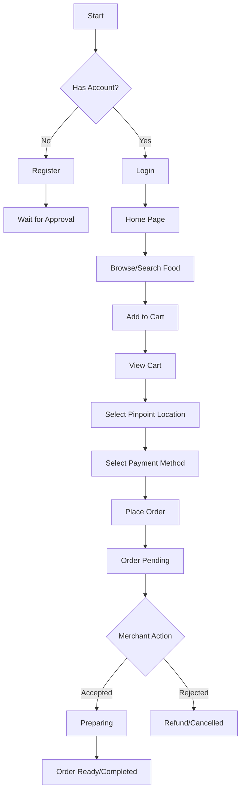
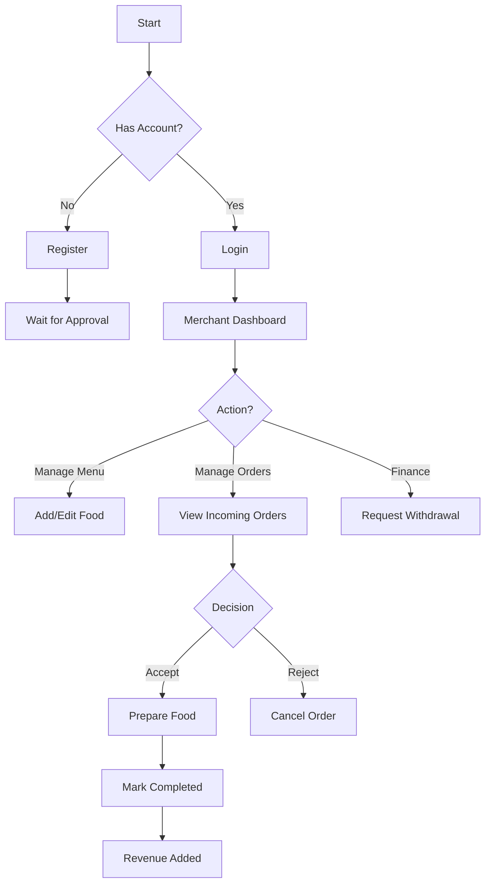
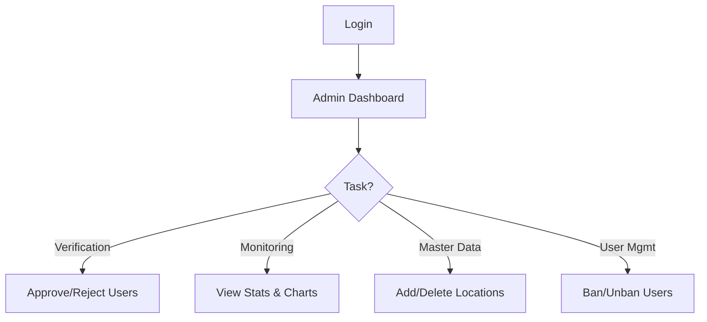

# EAT.Z - Future of Food Ordering | Project Documentation

## 1. Project Overview
**EAT.Z** is a futuristic, Gen Z-inspired food delivery application designed to streamline the connection between hungry customers and local merchants within a specific campus or facility. The application focuses on a "pinpoint" delivery system where orders are delivered to specific, pre-defined shelters or landmarks rather than arbitrary addresses, ensuring efficiency and security.

## 2. Project Goals
*   **Efficiency**: Simplify the ordering process with a "pinpoint" location system.
*   **Aesthetic**: Provide a modern, engaging, and "Gen Z" visual experience using neon colors, glassmorphism, and dynamic interactions.
*   **Empowerment**: Enable local merchants to easily manage their digital storefronts and finances.
*   **Control**: Give administrators full oversight of the platform's users and master data.

## 3. Features by Role

### 👤 Customer
*   **Authentication**: Sign up and log in securely.
*   **Browse & Search**: View all available food items, filter by category (e.g., Fast Food, Japanese), and search by name.
*   **Wallet System**: Top up digital balance for seamless payments.
*   **Cart Management**: Add items, adjust quantities, and view total cost.
*   **Checkout**: Select a specific **Pinpoint Location (Shelter)** for pickup and choose between Wallet or Cash payment.
*   **Order Tracking**: View the status of active orders (Pending -> Accepted -> Completed).

### 🏪 Merchant
*   **Onboarding**: Register a new merchant account (requires Admin approval).
*   **Dashboard**: View real-time statistics:
    *   Total Revenue
    *   Available Balance (Withdrawable)
    *   Sales Charts (Weekly/Monthly/Yearly)
*   **Menu Management**:
    *   Add new food items with images and descriptions.
    *   Edit existing items.
    *   Toggle item availability (Active/Inactive).
*   **Order Management**:
    *   Receive incoming orders.
    *   **Accept** or **Reject** orders.
    *   Mark orders as **Completed** once delivered.
*   **Financials**:
    *   View "Available Balance" (Revenue from completed orders).
    *   Request **Withdrawals** to a bank account.

### 🛡️ Admin
*   **Dashboard**: Comprehensive overview of platform health (Total Users, Active Merchants, Total Orders, Total Revenue).
*   **User Verification**:
    *   Review pending Merchant and Customer registrations.
    *   **Approve** or **Ban** users.
*   **User Management**: View all users and manage their access status.
*   **Master Data (Locations)**:
    *   Manage the list of "Pinpoint" locations (Shelters).
    *   Add new locations with specific details (e.g., "Lobby A - Near Elevator").
    *   Delete obsolete locations.

---

## 4. User Flows (Flowcharts)

### Customer Flow

### Merchant Flow

### Admin Flow

---

## 5. User Guide

### For Customers
1.  **Registration**: Go to the Sign-Up page. Fill in your details. Note that you may need to wait for Admin approval before logging in.
2.  **Top Up**: On the Home page, click the "+" icon next to your balance to add funds to your wallet.
3.  **Ordering**:
    *   Browse the "Popular" or "All Food" sections.
    *   Click "Add" on items you crave.
    *   Go to the "Cart" (shopping bag icon).
    *   **Crucial Step**: Select your **Pickup Location** from the dropdown.
    *   Click "Checkout".
4.  **Status**: You will be notified when the merchant accepts your order.

### For Merchants
1.  **Setup**: Register as a merchant. Once approved, log in.
2.  **Menu**: Go to the "Menu" tab. Click "Add New Item" to populate your store. Ensure you have attractive photos!
3.  **Processing Orders**:
    *   Go to the "Orders" tab.
    *   You will see "Incoming Orders". Click **Accept** to start preparing.
    *   Once you have handed the food to the customer or delivered it to the pinpoint, click **Complete**.
4.  **Getting Paid**:
    *   Go to the "Dashboard" tab.
    *   Check your "Available Balance".
    *   Click **Withdraw**, enter your bank details, and submit.

### For Admins
1.  **Verification**: Check the "Verification" tab daily. New users cannot access the platform until you click **Approve**.
2.  **Locations**: If a new meeting point is established on campus, go to the "Locations" tab and add it (e.g., "New Gym Entrance").
3.  **Oversight**: Use the "User List" to manage bad actors by banning them if necessary.
