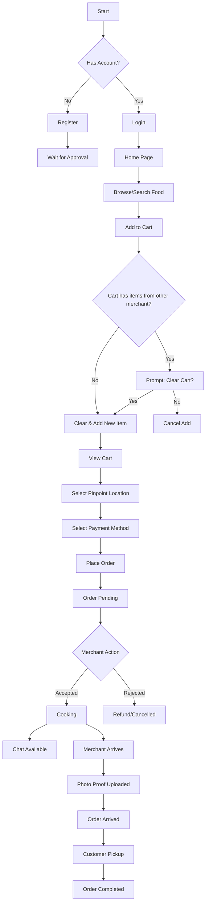
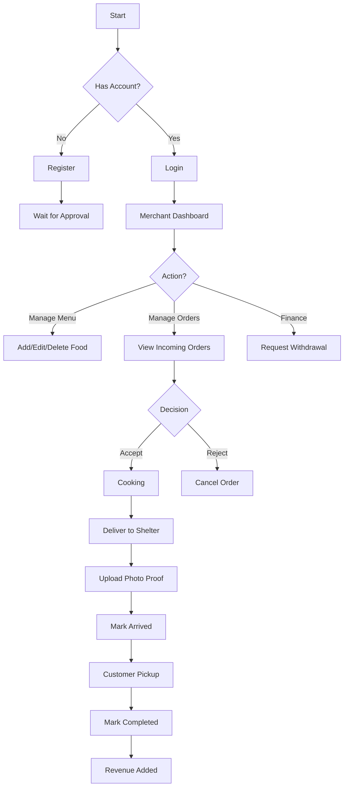
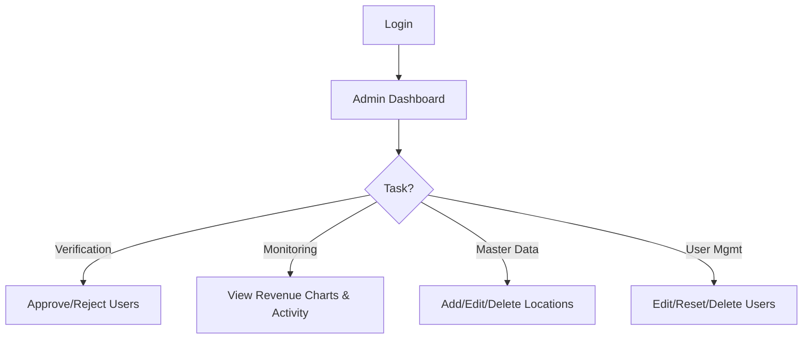

# EAT.Z - Future of Food Ordering | Project Documentation

## 1. Project Overview
**EAT.Z** is a futuristic, Gen Z-inspired food delivery application designed to streamline the connection between hungry customers and local merchants within a specific campus or facility. The application focuses on a "pinpoint" delivery system where orders are delivered to specific, pre-defined shelters or landmarks rather than arbitrary addresses, ensuring efficiency and security.

## 2. Project Goals
*   **Efficiency**: Simplify the ordering process with a "pinpoint" location system.
*   **Aesthetic**: Provide a modern, engaging, and "Gen Z" visual experience using neon colors, glassmorphism, and dynamic interactions.
*   **Empowerment**: Enable local merchants to easily manage their digital storefronts and finances.
*   **Control**: Give administrators full oversight of the platform's users and master data.

## 3. Features by Role

### 👤 Customer
*   **Authentication**: Sign up and log in securely.
*   **Browse & Search**: View all available food items, filter by category (e.g., Fast Food, Japanese), and search by name.
*   **Wallet System**: Top up digital balance for seamless payments.
*   **Cart Management**: Add items, adjust quantities, and view total cost.
*   **Checkout**: Select a specific **Pinpoint Location (Shelter)** for pickup and choose between Wallet or Cash payment.
*   **Order Tracking**: View the status of active orders (Pending -> Accepted -> Completed).

### 🏪 Merchant
*   **Onboarding**: Register a new merchant account (requires Admin approval).
*   **Dashboard**: View real-time statistics:
    *   Total Revenue
    *   Available Balance (Withdrawable)
    *   Sales Charts (Weekly/Monthly/Yearly)
*   **Menu Management**:
    *   Add new food items with images and descriptions.
    *   Edit existing items.
    *   Toggle item availability (Active/Inactive).
*   **Order Management**:
    *   Receive incoming orders.
    *   **Accept** or **Reject** orders.
    *   Mark orders as **Completed** once delivered.
*   **Financials**:
    *   View "Available Balance" (Revenue from completed orders).
    *   Request **Withdrawals** to a bank account.

### 🛡️ Admin
*   **Dashboard**: Comprehensive overview of platform health (Total Users, Active Merchants, Total Orders, Total Revenue).
*   **User Verification**:
    *   Review pending Merchant and Customer registrations.
    *   **Approve** or **Ban** users.
*   **User Management**: View all users and manage their access status.
*   **Master Data (Locations)**:
    *   Manage the list of "Pinpoint" locations (Shelters).
    *   Add new locations with specific details (e.g., "Lobby A - Near Elevator").
    *   Delete obsolete locations.

---

## 4. Business Process

The core business processes of EAT.Z are designed to ensure a smooth, transparent, and efficient experience for all stakeholders.

### 4.1. Customer Ordering Process
1.  **Selection**: The customer browses the menu, filtering by category or searching for specific items.
2.  **Cart Management**:
    *   Items are added to the cart.
    *   **Constraint**: The system enforces a "Single Merchant" policy. If a customer tries to add items from a different merchant, they are prompted to clear their current cart first.
3.  **Checkout**:
    *   The customer reviews their order.
    *   **Location Selection**: A specific "Pinpoint Location" (Shelter) is selected for delivery.
    *   **Payment**: The customer chooses between "Wallet" (digital balance) or "Cash".
4.  **Order Placement**: The order is submitted and enters the "Pending" state.
5.  **Tracking & Communication**:
    *   The customer tracks the status: `Pending` -> `Cooking` -> `Arrived` -> `Completed`.
    *   **Chat**: During the `Cooking` phase, the customer can chat with the merchant to provide specific instructions or ask questions.
6.  **Pickup**: Once the order arrives at the shelter, the customer collects their food.

### 4.2. Merchant Fulfillment Process
1.  **Order Reception**: The merchant receives a notification of a new "Pending" order in their dashboard.
2.  **Acceptance**: The merchant reviews the order details and clicks **Accept**. The status changes to `Cooking`.
3.  **Preparation**: The merchant prepares the food.
4.  **Delivery to Shelter**:
    *   The merchant (or their runner) delivers the food to the specified Pinpoint Location.
    *   **Validation**: Upon arrival, the merchant clicks **"Mark Arrived at Shelter"**.
    *   **Proof of Delivery**: A modal appears requiring the merchant to upload a **photo proof** of the food at the location.
    *   **Notification**: The status updates to `Arrived`, and the customer is notified.
5.  **Completion**: Once the customer picks up the food, the order is marked as `Completed`.

### 4.3. Admin Management Process
1.  **Onboarding & Verification**:
    *   New merchants and customers register.
    *   The Admin reviews these pending accounts in the "Verification" tab and approves them.
2.  **Monitoring**:
    *   The Admin monitors platform health via the Dashboard.
    *   **Analytics**: A "Revenue per Merchant" chart provides insights into top-performing vendors.
    *   **Activity Feed**: A detailed "Recent Activity" log shows who ordered from whom.
3.  **User Management**:
    *   The Admin can **Edit** user profiles, **Reset Passwords**, or **Delete** users if necessary.
4.  **Master Data Management**:
    *   The Admin manages the list of Pinpoint Locations (Shelters).
    *   Locations can be **Added**, **Edited**, or **Deleted** to keep the delivery points accurate.

---

## 5. User Flows (Flowcharts)

### Customer Flow

### Merchant Flow

### Admin Flow

---

## 6. User Guide

### For Customers
1.  **Registration**: Go to the Sign-Up page. Fill in your details. Note that you may need to wait for Admin approval before logging in.
2.  **Top Up**: On the Home page, click the "+" icon next to your balance to add funds to your wallet.
3.  **Ordering**:
    *   Browse the "Popular" or "All Food" sections.
    *   Click "Add" on items you crave. **Note:** You can only order from one merchant at a time.
    *   Go to the "Cart" (shopping bag icon).
    *   **Crucial Step**: Select your **Pickup Location** from the dropdown.
    *   Click "Checkout".
4.  **Status**: You will be notified when the merchant accepts your order. You can chat with them while they are cooking.

### For Merchants
1.  **Setup**: Register as a merchant. Once approved, log in.
2.  **Menu**: Go to the "Menu" tab. Click "Add New Item" or use the **Edit/Delete** buttons to manage your offerings.
3.  **Processing Orders**:
    *   Go to the "Orders" tab.
    *   Click **Accept** on incoming orders.
    *   **Delivery**: When you arrive at the shelter, click **"Mark Arrived"**. You **MUST** upload a photo of the food at the location to proceed.
4.  **Getting Paid**:
    *   Go to the "Dashboard" tab.
    *   Check your "Available Balance" and "Revenue Charts".
    *   Click **Withdraw**, enter your bank details, and submit.

### For Admins
1.  **Verification**: Check the "Verification" tab daily. New users cannot access the platform until you click **Approve**.
2.  **Locations**: Manage delivery points in the "Locations" tab. You can now **Edit** details if a location changes.
3.  **Oversight**:
    *   Use the "User List" to **Edit**, **Reset Password**, or **Delete** users.
    *   Monitor the "Revenue per Merchant" chart to identify top performers.
